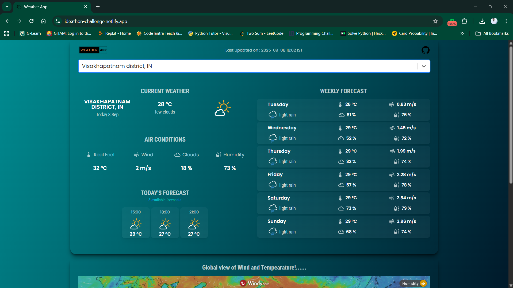

# Ideathon Challenge

 

[Weather APP](https://ideathon-challenge.netlify.app/) is developed using React.js where User can search their city name and observe their weather for the next 5-6 days.
# Live Demo:

Link: https://ideathon-challenge.netlify.app/

# Used libraries

- `react-js`
- `material-ui`

# Team Members 
1. Gorle Durga Abhiram
2. Rishita Kakarlapudi
3. Harshita Labhala  
4. Goutham Paila
